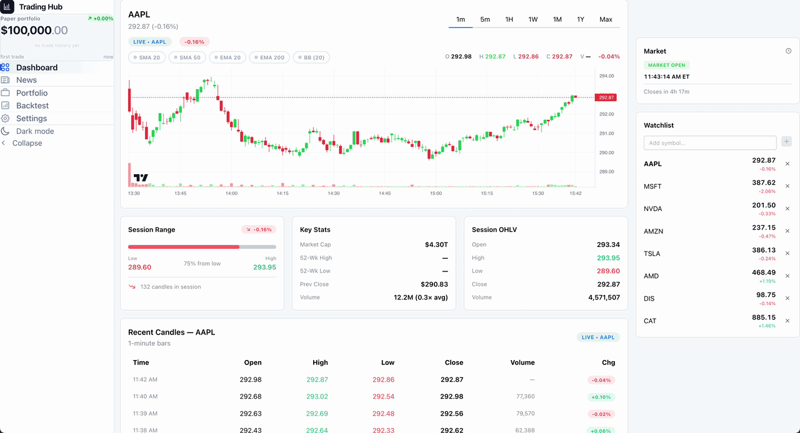
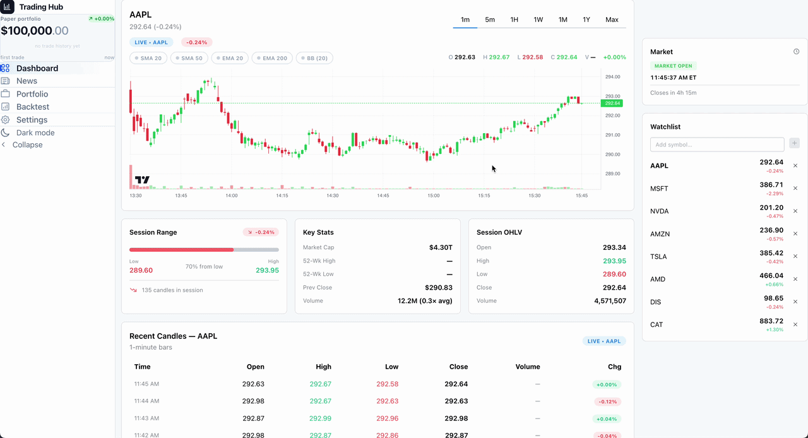
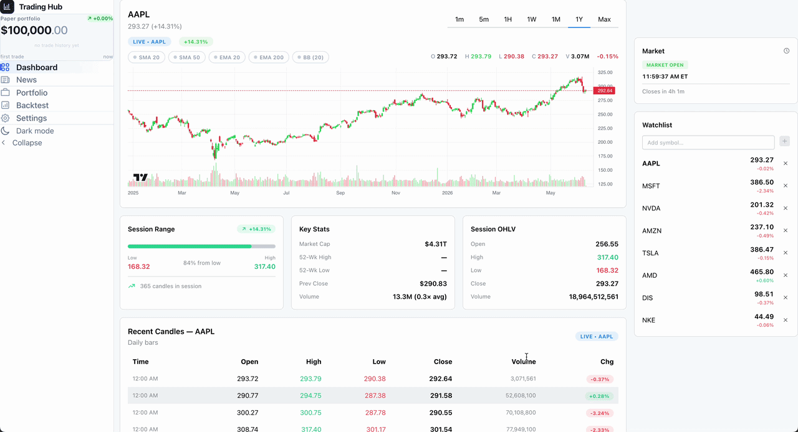
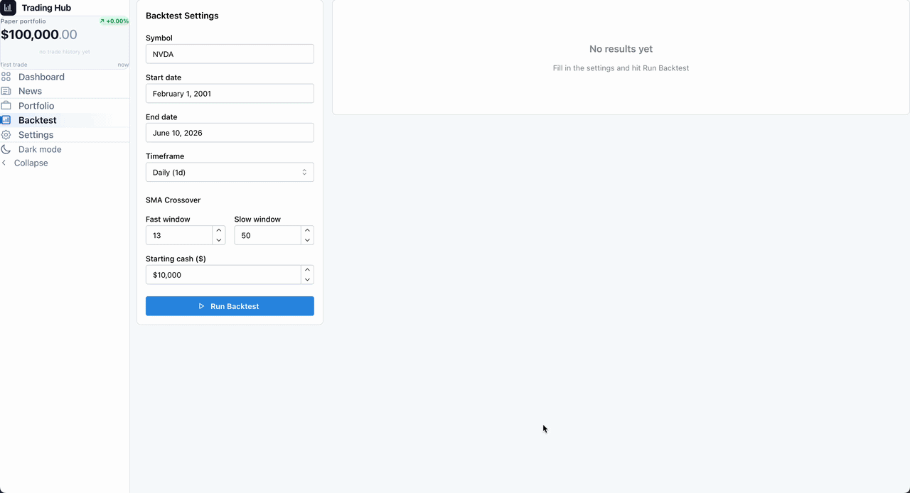
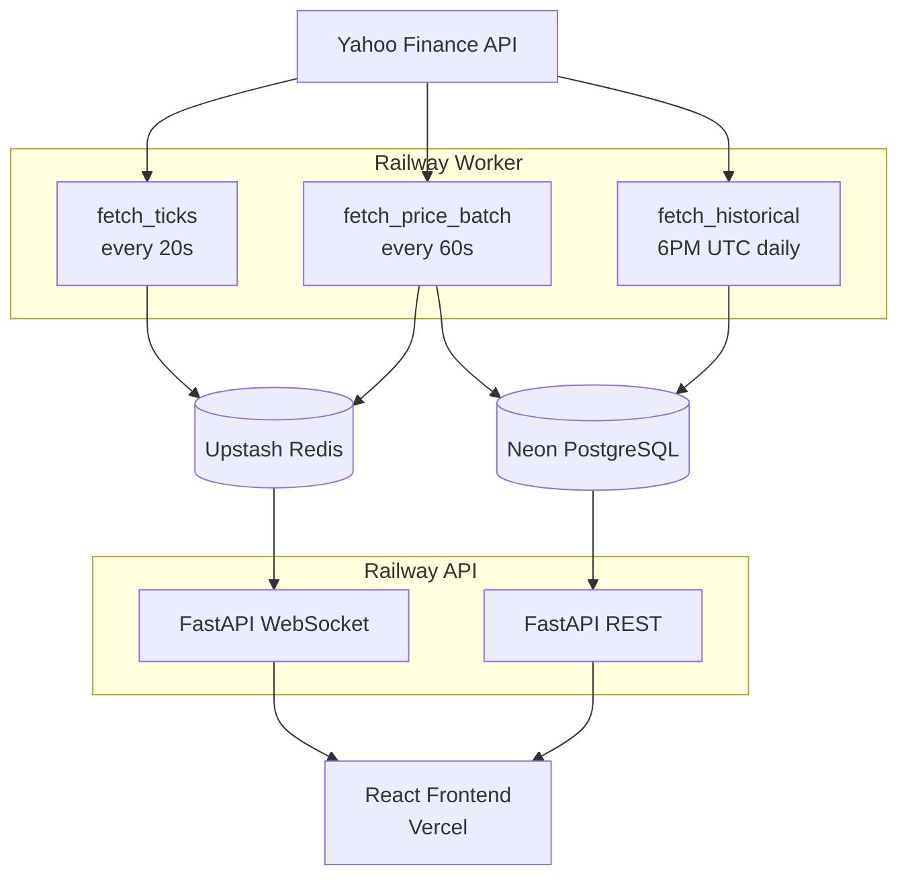

# Personal Trading Hub

A self-hosted stock dashboard with real-time price feeds, candlestick charts, paper trading, and backtesting; deployed to Railway and Vercel.

**Live demo:** [(https://personal-trading-hub-frontend.vercel.app/dashboard)](https://personal-trading-hub-frontend.vercel.app/dashboard)

---

## What it looks like

### Live price feed


### Candlestick charts


### Chart overlays


### Backtesting


---

## Features

- **Real-time prices** — WebSocket feed updates every 20 seconds via Celery and Redis
- **Candlestick charts** — 1m, 5m, 1H, 1D, 1W, 1M, 1Y, and Max timeframes
- **Watchlist** — add any valid ticker and their historical data seeds in the background
- **Paper trading** — buy/sell positions, real-time unrealized P&L, and an equity curve
- **Backtesting** — SMA crossover strategy with CAGR, max drawdown, and full trade history
- **News feed** — recent headlines per symbol
- **Google OAuth + email/password auth**

---

## Architecture



---

## Engineering Challenges

**Database timeout on bulk inserts**
Seeding historical price data for a new symbol meant inserting about 1,260 daily bars into Neon PostgreSQL. By default, each row was committed individually, and every commit triggered roughly a 50 ms round-trip to Neon’s server, which added up to about 63 seconds and went over Railway’s HTTP timeout. I fixed it by batching commits every 100 rows, cutting the round-trips to 13 and reducing the insert time to under a second.

**Celery worker blocking on startup**
The worker was automatically instantiating a full historical backfill on startup. Since `worker_concurrency=1`, that backfill took control of the worker for over 15 minutes while processing every watched symbol, which prevented `fetch_ticks` and `fetch_price_batch` from running during that time.

To fix this, I removed the backfill that auto triggers on startup. Historical backfills now run only through the daily scheduled 6 PM UTC job, and any new added symbols are seeded immediately through the `/symbols/seed` endpoint instead.


**WebSocket zombie loop on disconnect**
When a client disconnected, the WebSocket handler would continue polling Redis and trying to send updates to a closed connection for basically forever. The issue was that a single `except Exception` block handled both Redis and WebSocket send failures, even though they need to be handled differently.

Redis errors are recoverable and shouldn't stop the polling loop, whereas send failures indicate the client has disconnected. I Separated the exception handling so Redis failures are handled and retried in memory, while send failures kill the handler.


---

## Tech Stack

| Layer | Tech |
|---|---|
| Frontend | React, TypeScript, Vite, Mantine UI, Lightweight Charts, Recharts |
| Backend | FastAPI, SQLAlchemy, Alembic, Pydantic |
| Workers | Celery, Celery Beat |
| Database | PostgreSQL (Neon production) |
| Cache / Broker | Redis (Upstash TLS in production) |
| Auth | Google OAuth2 (Authlib) + JWT + bcrypt |
| Hosting | Railway (API + worker), Vercel (frontend) |
| CI | GitHub Actions (pytest, tsc, Docker build) |

---

## Run locally

**Prerequisites:** Docker + Docker Compose

1. Clone the repo:
```bash
git clone https://github.com/SH343246/personal-trading-hub.git
cd personal-trading-hub
```

2. Copy and fill in the env file:
```bash
cp .env.example .env
```

```env
# Local Postgres (used by docker-compose)
POSTGRES_USER=postgres
POSTGRES_PASSWORD=postgres
POSTGRES_DB=trading

DATABASE_URL=postgresql+psycopg://postgres:postgres@db:5432/trading
REDIS_URL=redis://redis:6379

# Auth
SESSION_SECRET=any-random-string
JWT_SECRET=any-random-string
JWT_ALG=HS256
ACCESS_TTL_MIN=60
REFRESH_TTL_DAYS=7

# Optional — Google OAuth (skip if you are using email/password only)
GOOGLE_CLIENT_ID=your-google-client-id
GOOGLE_CLIENT_SECRET=your-google-client-secret
GOOGLE_REDIRECT_URI=http://localhost:8000/api/auth/google/callback
FRONTEND_REDIRECT_URI=http://localhost:5173/auth/callback

# Default seeded symbols to watch on worker startup
SYMBOLS=AAPL,MSFT,NVDA,TSLA,AMZN
```

3. Start all services:
```bash
docker compose up --build
```

4. Open [http://localhost:5173](http://localhost:5173)

The worker will begin fetching prices immediately. Historical chart data populates on the first scheduled run at 6PM UTC, or you can manually trigger it by adding a symbol from the watchlist.

---

## Deployment

**Backend + Worker:** Railway — connect the repo, set env vars from `.env.example` in the Railway dashboard, deploy as two separate services (API and worker).

**Frontend:** Vercel — set `VITE_API_URL` to your Railway backend url.

**Database:** Neon PostgreSQL — set `DATABASE_URL` to your Neon connection string (`postgresql+psycopg://...`).

**Redis:** Upstash — set `REDIS_URL` to your Upstash TLS URL (`rediss://...`). 

After deploying the backend, run Alembic migrations once:
```bash
alembic upgrade head
```
